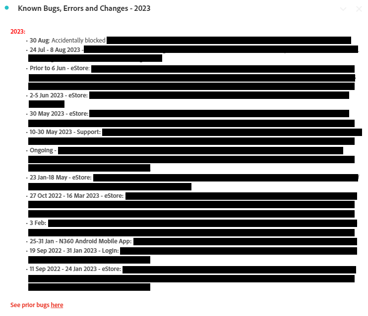

# Creazione di dashboard operative in Analysis Workspace

_Scopri in che modo le dashboard operative nell’area lavoro di Adobe Analytics rivoluzionano la comunicazione e l’efficienza. Scopri come creare dashboard di domande frequenti, notizie e annunci, bug e funzionalità per ottenere informazioni semplificate, un’esperienza utente migliorata e un coinvolgimento avanzato._

Come molti amministratori, gestisco un hub di informazioni interno (Confluence o simile) per Adobe Analytics. Nel tempo, mi sono stancato di rispondere alle stesse continue domande e avevo bisogno di un modo più agevole per raggiungere i miei utenti senza sentirmi come se li stessi martellando o infastidendo tutte le volte. Avevo bisogno di archivi per le informazioni meno statici.

Mi sono accorto che gli utenti spesso ignoravano i miei riferimenti al sito di Confluence, adducendo motivi come “La mia VPN è spenta” o “Non posso leggerlo ora”, ecc. Sostanzialmente quel “Leggerò il documento più tardi” significa che non verrà mai letto, e la stessa domanda verrà posta di nuovo la settimana successiva.

***Hit di realizzazione:**la versatilità di Workspace potrebbe essere decisiva. Gli utenti preferiscono risposte rapide e dirette all’interno di Workspace, quindi è importante mantenerle lì ed evitare passaggi aggiuntivi.*

Sono andato avanti e ho creato dashboard operative da condividere a livello aziendale. Finora, hanno mantenuto gli utenti aggiornati, centralizzato le informazioni e ridotto la conseguente frustrazione. Si è trattato di un processo semplice e in continua evoluzione che migliora l’efficienza col tempo.

Le persone hanno potuto ricevere molte informazioni utili senza la mia continua presenza, capire le aree del sito, vedere quanto è funzionale Adobe Analytics e, cosa importante per me, farmi meno domande e quindi richiedere meno del mio tempo.

**Ti consiglio vivamente di creare dashboard per tutte le proprietà o le aree principali del sito.** Dovranno fornire una panoramica della proprietà/sito/app/flusso e disporre di informazioni di base in modo rapido. Dovranno essere condivise con tutta azienda, consentendo a tutti gli utenti di comprendere la proprietà senza alcuna difficoltà. La mia esperienza mi porta a considerare che queste dashboard rispondono solitamente all’80% delle domande che ricevo, facendomi risparmiare tempo prezioso.

E al contempo, è possibile continuare a mantenere il sito Confluence, poiché è davvero tanto utile. Faccio riferimento anche a questo, nella parte superiore di ogni dashboard operativa. Ma adoro le scelte rapide, sia per me che per i miei utenti.

Lasciate che vi spieghi le tre dashboard operative che ho creato per la mia azienda, GenDigital, che mi hanno aiutato a raggiungere questi obiettivi.

1. Domande frequenti
1. Novità e annunci
1. Registro bug, funzioni e versioni principali

## 1 - Dashboard delle domande frequenti

L’interminabile circolo di risposte ripetute ti stanca? Basta! Risparmia tempo creando una dashboard di domande frequenti. Gli utenti possono consultarla prima di fare domande oppure è possibile collegarla rapidamente alle risposte.

Crea solo [visualizzazioni di testo](https://experienceleague.adobe.com/docs/analytics/analyze/analysis-workspace/visualizations/text.html?lang=it) con domande formattate come titoli e risposte/spiegazioni come contenuto, il tutto compresso per mostrare solo la domanda. Raggruppale per rilevanza (ad esempio, pagine o prodotti) o utilizza i pannelli. Semplificale, dando priorità alle query comuni nella parte superiore.

Invece di scrivere e-mail lunghe o recuperare spiegazioni precedenti, aggiorna la dashboard delle domande frequenti. Inizia ora e ampliala nel tempo. Utilizza i collegamenti ipertestuali per fare riferimento ad altre dashboard o a domande frequenti correlate all’interno dei rapporti. Fornisci un contesto complesso quando necessario, collegando altre dashboard alle domande frequenti.

Per Gen Digital, le domande frequenti si concentrano sull’utilizzo personalizzato di Adobe Analytics, non sulle nozioni di base. Invia collegamenti a domande frequenti specifiche per e-mail, facendo clic con il tasto destro del mouse, selezionando “Ottieni collegamento di visualizzazione” e condividendo il vanity URL. Questo evidenzia il contenuto esatto per gli utenti. Utilizza le tabelle a forma libera per illustrare i dati, aggiungendo ulteriori spiegazioni con “modifica descrizione”.

Quando le domande frequenti ti sembreranno complete, condividile con l’azienda per un accesso e un apprendimento collettivi. Continua a migliorarle secondo le necessità.

Ecco alcune schermate dell’aspetto di una dashboard di domande frequenti:

## 2 - Dashboard per notizie e annunci

Un’altra dashboard operativa utile è quella di notizie e annunci. Ho iniziato questa perché volevo che i miei utenti ricevessero informazioni, ma mi è sembrato invece di dar loro fastidio. Hanno tutti bisogno di questo aggiornamento? Quali utenti? Solo gli utenti esperti? Dovrei inviare una newsletter settimanale che nessuno leggerà? Se invece l’aggiornamento viene visualizzato direttamente in Workspace, gli utenti possono vederlo non appena accedono e non è necessario inviare un’altra e-mail aziendale che nessuno desidera leggere.

Poiché queste dashboard sono visibili a livello aziendale, gli aggiornamenti hanno subito la priorità. Ecco il tipo di informazioni che io includo nella dashboard di notizie e annunci:

- Versioni future e aggiornamenti da parte nostra (principalmente versioni del codice)
- Nuove funzioni importanti da Adobe
- Pianificazione dell’orario d’ufficio
- Elenco di tutte le dashboard di panoramica e dei rapporti interessanti a cui dare un’occhiata

Sono incluse le nuove funzionalità, il tracciamento e le dashboard fondamentali. I collegamenti ipertestuali all’interno dei rapporti di testo (o in cima ad altri rapporti tramite pulsante destro del mouse e modifica la descrizione) ti consentono il collegamento ad altre dashboard in Adobe Analytics o nella pagina di rilascio delle funzioni di Adobe.

Ecco come si presenta la mia dashboard di notizie e annunci:

## 3 - Registro bug, funzioni e versioni principali

L’obiettivo di questa dashboard operativa è di avere una posizione centrale dove inserire tutti i bug e gli errori. In precedenza gestivo il problema in Excel, ma era difficile e complicato condividerlo. Perché non inserirlo direttamente in Workspace?

Puoi integrarlo nella dashboard Notizie e annunci se desideri che sia meno in primo piano. Tuttavia, se la segnalazione di bug è importante o critica per la tua azienda, potrebbe essere più saggio disporre di una dashboard separata.

Uso una visualizzazione di testo e la mantengo molto semplice con i punti elenco. Il punto elenco viene preceduto dalla data del bug e dalla proprietà (ad esempio: “3gen23-17gen23 - Norton.com”, “Prima del 14set22 - Chat”). Poi aggiungo i dettagli e cerco di mantenerli brevi e concisi. Evito di indicare il team in errore e di aggiungere troppi dettagli tecnici che probabilmente non interessano agli utenti.

Il bug più recente si trova nella parte superiore, mentre quelli precedenti si trovano nei rapporti di testo annuali (ad esempio: “2022 - Bug noti, errori e modifiche”), tutti compressi.

Niente di speciale. Molto facile da fare, e devi ammettere, molto meglio di quel file Excel che tieni sul disco rigido e continui ad aggiornare su Confluence.

Faccio riferimento anche alle dashboard di panoramica e report interessanti, simili alle altre dashboard operative. I collegamenti alle domande frequenti e alle dashboard di notizie e annunci sono verso l’alto.

Di seguito è riportato un esempio di come potrebbe apparire il registro:

La creazione di dashboard operative in Adobe Analytics Workspace è stata fondamentale per me. Come molti amministratori, ho gestito un hub interno e ho lottato con la duplicazione delle risposte e una comunicazione utente efficace. La necessità di archivi dinamici ha portato alla consapevolezza che la versatilità di Workspace potrebbe rivoluzionare il coinvolgimento. Spero che tu comprenda la potenza delle dashboard operative in Adobe Analytics Workspace. Migliora l’esperienza degli utenti, risparmia tempo e goditi un ambiente più organizzato. Il percorso inizia ora e queste dashboard sono le chiavi per l’efficienza e la facilità d’uso.

## Autore

Questo documento è stato scritto da:

**Christel Guidon**, Analytics Platform Manager presso Gen Digital

Adobe Analytics Champion