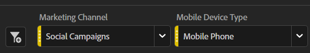

# Possibilità di utilizzare con successo dashboard di riepilogo esecutivi

_I dirigenti spesso mancano informazioni tempestive e rilevanti per i loro siti e le loro app, affidandosi a grafici Excel mensili o annegando in dati granulari. La soluzione: dashboard di riepilogo esecutivo._

Voglio che immaginiate guidare da Seattle a San Francisco. Senz&#39;altro, è abbastanza facile. Vai su I-5 Sud per dodici-sedici ore e ci sei. Semplice, vero? Ora, voglio che immaginiate che io abbia messo un pezzo di cartone sul vostro cruscotto, e vi dico che alla fine del vostro viaggio riceverete un cruscotto che vi dice la vostra velocità, i livelli di carburante e la distanza percorsa:

Esaminando il grafico, potresti notare alcuni aspetti:

1. La vostra velocità variava enormemente, ben oltre il limite di velocità legale ad alcuni punti, e molto bassa ad altri punti a causa di cose come il traffico di Portland

1. La distanza percorsa è statica per ore 6-9

1. Questo perché il vostro carburante è sceso allo 0% e avete dovuto aspettare l&#39;assistenza stradale per passare attraverso il traffico Portland e riempire il vostro serbatoio di gas

Un viaggio del genere sarebbe ovviamente miserabile, imprevedibile e pericoloso.
Non c&#39;è modo di guidare. È necessario disporre di informazioni continue sulla velocità, la distanza percorsa e i livelli di carburante per effettuare regolazioni continue nel modo in cui si guida. Senza dubbio, una persona ragionevole strapperebbe il cartone dal cruscotto e controllerebbe regolarmente, che raderebbe ore fuori dalla lunghezza del viaggio, quasi eliminerebbe il rischio di esaurire il gas, e vi manterrebbe in movimento alla velocità giusta per evitare un biglietto in eccesso di velocità.

Allora perché così tanti dirigenti accettano questo come un modo ragionevole di eseguire i loro siti e le loro app?

Molti dirigenti non hanno accesso a informazioni rilevanti e continuative necessarie per agire in modo tempestivo. Al contrario, ricevono un deck una volta al mese con statistiche esportate da Adobe Analytics in Excel, registrate e poi inserite in un PowerPoint. Se un punto di flessione si verifica all&#39;inizio del mese, non lo sapranno fino all&#39;inizio del mese successivo, ben dopo che possono fare domande o intraprendere azioni.
Anche gli avvisi personalizzati sono una grande opzione, ma tutti sappiamo come si presenta una casella in entrata e-mail di un exec.

Ma i dirigenti sono anche molto occupati. Immaginate di fare lo stesso viaggio, ma invece del quadro comandi pulito che avete nella vostra auto, avete avuto non solo il livello di carburante, odometro, e taedometro, ma anche altre due dozzine di metri che vi danno dati incredibilmente granulari su tutto, dai livelli di liquido tergicristallo a una durata stimata dei filtri dell&#39;olio.
Sarebbe troppo, troppo specifico, troppo specializzato.

Volete che i dirigenti abbiano abbastanza dati per sapere quando la loro attenzione è necessaria immediatamente, non tanto che alzano le mani in frustrazione. Se un proprietario di prodotto o un responsabile marketing desidera ricevere un messaggio relativo a un’anomalia, questo viene visualizzato.

Qui è dove il dashboard di riepilogo esecutivo arriva come il mezzo felice. La maggior parte dei dirigenti ha circa tre KPI che sono profondamente preoccupati. Nel settore retail, potrebbero essere ordini, ricavi e AOV. Per B2B, lead, qualità del lead e tasso di conversione. I servizi potrebbero essere interessati a visite, appuntamenti e visitatori di ritorno. Qualunque siano i tre, inseriscili in grandi numeri audaci con un cambio di anno in anno e un grafico. La visualizzazione Riepilogo della metrica chiave semplifica notevolmente l’operazione:

Aggiungi i dati storici per le stesse tre metriche in modo da visualizzare facilmente le tendenze a lungo termine:

Aggiungi un paio di elenchi a discesa per qualsiasi cosa sia importante per la tua organizzazione. Trovo che il tipo di dispositivo e il canale di marketing siano di solito buone scommesse:

Sono entrambi abbastanza importanti nel complesso, ma come sempre, assicurati che ciò che scegli sia rilevante per il tuo sito o la tua app.

Infine, in basso, aggiungete un po&#39; di dettagli. Trovo che le prestazioni della pagina siano spesso popolari tra i dirigenti, ma la chiave è che si trovano sotto la piega.
Possono cercarlo se lo vogliono, ma in caso contrario, hanno i dati di cui hanno bisogno per porre domande immediatamente:

Con questo prodotto finale in mano, è sufficiente:

- Formare i tuoi dirigenti su come leggerlo

- Informali su come utilizzare i filtri

- Formateli su come fare un drill-down di base

- Prendi un po&#39; di caffè e preparati, perché una volta che sono dotati di dati, i dirigenti verranno da te con un sacco di domande

In conclusione, i dashboard di riepilogo esecutivo offrono informazioni rilevanti e continuative per il processo decisionale tempestivo. I deck mensili con i grafici Excel sono insufficienti e fornire troppi dati granulari può sopraffare i dirigenti. Un mezzo utile è quello di concentrarsi sui tre KPI più importanti con dati storici e elenchi a discesa per i fattori rilevanti. Formando i dirigenti su come utilizzare il dashboard, possono prendere decisioni informate e fare domande. Dashboard di riepilogo esecutivo possono migliorare le prestazioni di siti e app e favorire il successo.

## Autore

Questo documento è stato scritto da:

**Gitai Ben Ammi**, Consulente principale di Concentrix Catalyst

Adobe Analytics Champion
