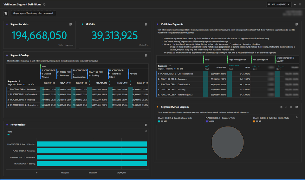

# Creazione di segmenti di Percorso dei clienti

Scopri come creare segmenti di percorso dei clienti basati sul comportamento in Adobe Analytics e migliorare l’esperienza dei clienti con Adobe Experience Cloud seguendo questa guida dettagliata.

Creiamo segmenti di percorso dei clienti migliori! In questa serie utilizzeremo Adobe Analytics per definire segmenti basati sul comportamento, stimare le dimensioni del pubblico e monitorare il movimento degli utenti. Entro la fine, potrai personalizzare i contenuti multimediali e migliorare l’esperienza dei clienti con Adobe Experience Cloud. Tieni presente che questi segmenti sono viventi e devono essere aggiornati man mano che apprendi ulteriori informazioni sui clienti. Anche se il reporting può presentare alcune sfide, non preoccuparti, ti guiderò attraverso! Cominciamo creando il nostro primo set di segmenti di Percorso cliente, a partire dal segmento &quot;One Hit Wonders&quot;.

Oggi, creeremo dei segnaposto per il nostro primo set di segmenti di Percorso cliente, creeremo un’area di lavoro Adobe Analytics per aiutarci a definire i nostri segmenti e definire il nostro primo segmento, &quot;One Hit Wonders&quot;.

Entro la fine di questa serie, sarai in grado di creare segmenti di percorso dei clienti in Adobe Analytics in base ai segnali comportamentali. Potrai stimare la dimensione di ogni pubblico in ogni fase del percorso e capire a che tasso si spostano gli utenti tra questi stadi. Potrai inoltre esportare i tipi di pubblico dei percorsi di clienti in Adobe Experience Cloud per abilitare la personalizzazione e il targeting dei contenuti multimediali.

Ogni attività è diversa e ciò significa che i segmenti del tuo percorso di clienti avranno un aspetto diverso dal mio. Quindi, invece di prescrivere formule specifiche per i tuoi segmenti, suggerisci alcune cose da esaminare e un processo complessivo per costruirli.

È inoltre importante notare che i segmenti del percorso di clienti saranno segmenti live. Non si tratta di un esercizio da eseguire una sola volta. Man mano che apprendi ulteriori informazioni sui clienti, aggiornerai questi segmenti. Questo presenta alcune sfide per il reporting. Le persone desiderano che i rapporti siano coerenti e se le definizioni dei segmenti cambiano, anche i numeri nei rapporti cambieranno.

## Guida introduttiva ai segmenti di intento delle visite

Il primo passo per la creazione di segmenti di percorso dei clienti è quello di capire perché un ospite è sul tuo sito web utilizzando segnali comportamentali e, se disponibili, dati Voice of Customer. Verrà creato un set di segmenti Intento di visita per classificare tutte le visite sul sito web. A questo punto, i segmenti Intent per visite devono essere reciprocamente esclusivi e completamente esaustivi. Ogni visita deve appartenere a un segmento Intento visita e a un solo segmento.

I segmenti Intento di visita descrivono una visita, in modo da utilizzare il contenitore Visite nella definizione del segmento.

Il mio set iniziale di segmenti Intento visite include:

* Una meraviglia
* Consapevolezza
* Considerazione
* Prenotazione (acquisto)
* Mantenimento (gestire una prenotazione/acquisto)

Per semplificare l’utilizzo dei segmenti a scopo di visita, ho prefisso i nomi dei segmenti con &quot;Intento:&quot;, ho dato loro un numero per abilitare l’ordinamento e li ho contrassegnati come &quot;Intenti&quot;. I miei segmenti assomigliavano all&#39;immagine qui sotto.

**Crea i segmenti di intento delle visite utilizzando il contenitore Visite con una definizione segnaposto di Visualizzazioni pagina >= 1.**

Come vedremo, la creazione di questi segmenti è un processo iterativo e interconnesso. Descriverò il processo di creazione di questi segmenti in un post futuro.

## Area di lavoro sulla qualità dei dati dei segmenti con intento di visita

Ho utilizzato un’area di lavoro semplice per assicurarmi di definire bene i segmenti Intento di visita. Ricorda che ogni visita deve appartenere a un segmento Intento visita e solo a uno. L’area di lavoro impostata assicura che tutte le visite siano contabilizzate e che non vi sia sovrapposizione tra i segmenti.

Ho denominato questa area di lavoro &quot;DATA QUALITY: Visita i segmenti intento&quot; con i tag &quot;data quality&quot;, &quot;visit Intent&quot; e &quot;customer percorso&quot;. In seguito, creeremo un &quot;Dashboard intento visita&quot; in modo che il prefisso &quot;DATA QUALITY&quot; indichi che questo spazio di lavoro è per la configurazione e la manutenzione dei segmenti. Si tratta di un dashboard amministrativo con poche informazioni aziendali ma è importante per garantire che i segmenti vengano mantenuti. È consigliabile tornare regolarmente a questo dashboard, o impostare avvisi, per essere certi che i segmenti rimangano definiti correttamente.

La visualizzazione più importante in questa area di lavoro è la visualizzazione a forma libera Sovrapposizione segmento nel mezzo a sinistra. Utilizzando la metrica Visite, crea filtri a colonne per ciascuno dei segmenti Intento di visita, più il segmento Tutte le visite nella colonna più a destra. Crea righe per ogni segmento Intento visita a sinistra. Ora è disponibile una visualizzazione a più schede. Quando i segmenti sono configurati correttamente, ci saranno solo dati in una colonna e una riga, all’intersezione di ogni segmento Intento di visita con se stesso.

Le visualizzazioni più importanti successive sono le metriche di riepilogo in alto a sinistra. Il riepilogo Visite segmentate prende il suo valore dalla colonna Tutte le visite nella visualizzazione Sovrapposizione segmento immediatamente sottostante. Il riepilogo Tutte le visite ha la propria tabella nascosta.

In alto a destra, ho aggiunto metriche aggiuntive a ciascuno dei segmenti per dare un certo &quot;sapore&quot; alla forma dei segmenti. In particolare, poiché questi segmenti si escludono a vicenda, mi aspetto di vedere solo le prenotazioni per il segmento Intento di prenotazione (in caso contrario, raggiungeremo i tassi di conversione quando creeremo questi segmenti Intento di visita in base ai visitatori.

Tieni presente che abbiamo appena creato segmenti segnaposto. Quindi, inizialmente, il vostro spazio di lavoro sarà meraviglioso. Tutti i segmenti di intento delle visite si sovrappongono al 100% perché hanno la stessa definizione. Questo è corretto e esattamente ciò che si desidera vedere a questo punto del processo. Man mano che creiamo le definizioni dei segmenti, inizierai a vedere questi segmenti prendere forma.

## Creazione del segmento del primo intento di visita

Definire i segmenti dell’intento di visita è un po’ un processo di eliminazione, e c’è molta interdipendenza tra di essi. Quindi non ho costruito questi segmenti nell&#39;ordine del percorso, li ho costruiti in ordine dal più facilmente definito al più impegnativo. Mi ha dato questo ordine:

1. Intento: 0 - Una meraviglia Hit
1. Intento: 3 - Prenotazione
1. Intento: 4 - Mantenimento
1. Intento: 2 - Considerazione
1. Intento: 1 - Consapevolezza

Abbastanza casuale, eh? La definizione di questi segmenti di Intento visita era un processo iterativo, avanti e indietro e spesso un adeguamento a un segmento richiedeva aggiornamenti ad altri segmenti. Questo diventerà più chiaro mentre descrivo come ho definito ciascuno di questi segmenti.

Oggi, definiremo il nostro primo segmento, e più facile, One Hit Wonders

## Creazione del segmento One Hit Wonders

Il mio primo segmento, &quot;One Hit Wonders&quot;, era facile da definire. È semplicemente qualsiasi visita con una sola visualizzazione di pagina. Non sappiamo davvero perché quell&#39;utente era sul sito web, perché rimbalzavano. Suppongo che potremmo indovinare un intento in base alla loro pagina di ingresso, ma con una sola visualizzazione di pagina, non ci sono abbastanza informazioni per fare una stima informata sull&#39;intento.

Dopo aver definito questo segmento, inizierai a vedere il tuo Area di lavoro con intento di visita prendere forma.

Creare segmenti di percorso dei clienti utilizzando Adobe Analytics è un processo impegnativo ma gratificante. Creando segmenti basati sul comportamento, valutando le dimensioni del pubblico e monitorando i movimenti degli utenti, le aziende possono personalizzare i contenuti multimediali e migliorare la customer experience. Ogni business è univoco e non esistono formule specifiche per la creazione di segmenti, ma linee guida e un processo da seguire. I segmenti devono essere aggiornati man mano che le aziende imparano di più sui loro clienti, il che presenta sfide di reporting. Seguendo il processo di creazione dei segmenti Intento visite, le aziende possono migliorare l’esperienza complessiva dei clienti.

## Autore

Questo documento è stato scritto da:

**Aaron Fossum**, Director, Digital Analytics

Adobe Analytics Champion

