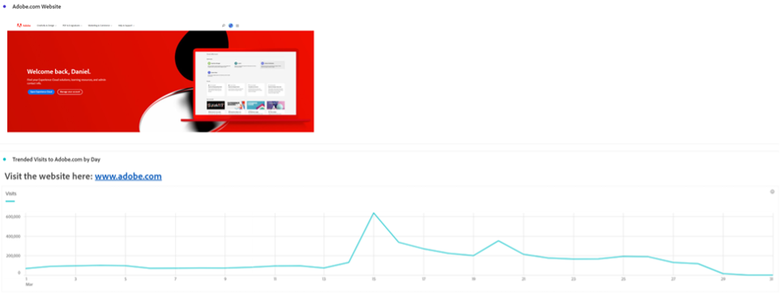
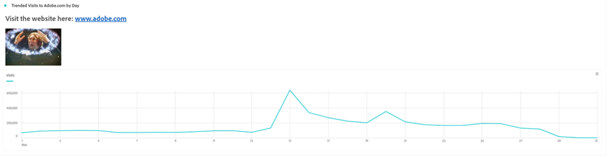

# Più di parole - Utilizzo di visualizzazioni e descrizioni di testo in Analysis Workspace

In qualità di utente di Adobe Analytics Analysis Workspace, è naturale che spesso la tua attenzione si concentri sulle visualizzazioni di dati e dati - qualcuno può digitare un riepilogo, giusto? Tuttavia, trascurare funzioni in Analysis Workspace come la visualizzazione Testo o le descrizioni di visualizzazione potrebbe significare perdere una preziosa opportunità di combinare le tue informazioni con testo, immagini, gif e collegamenti di valore. Fornendo riferimenti e più contesto per informare gli utenti del significato dei tuoi dati, può renderli più efficaci e di impatto.

In primo luogo, assicuriamoci di sapere dove trovare queste funzioni:

- Per aggiungere o modificare la descrizione di una visualizzazione, fai clic con il pulsante destro del mouse sull’area superiore dell’elemento e seleziona il collegamento &quot;Modifica descrizione&quot;:

   

- Per aggiungere un pannello Testo separato, fai clic sul menu Visualizations (Visualizzazioni) nella barra di navigazione a sinistra:

   

Questa guida mostra un esempio utilizzando uno di questi due metodi, ma consente di effettuare aggiunte simili sia nelle descrizioni che nelle visualizzazioni Testo. È inoltre possibile regolare la tonalità del font, l’allineamento, il colore e creare elenchi puntati o numerati:

Introduzione. Un contesto molto utile da aggiungere a qualsiasi progetto Analysis Workspace è un collegamento ipertestuale, che può includere il collegamento all’URL della pagina dettagliata nel rapporto, i collegamenti ad altri progetti Analysis Workspace, pagine contestuali di rapporti esterni o qualsiasi altra cosa utile da usare durante la visualizzazione del rapporto. Questa funzione è accessibile selezionando una parte qualsiasi del testo e selezionando l’icona &quot;link&quot;:

Il risultato è che chiunque visualizzi il progetto Analysis Workspace può raggiungere qualsiasi pagina accessibile online o nella Intranet della tua organizzazione con un solo clic:

Ora, se preferisci inserire il contenuto direttamente nel rapporto, puoi utilizzare un collegamento Immagine per inserire il contenuto accanto ai tuoi dati:

Puoi aggiungere un’immagine accessibile su qualsiasi URL pubblico al rapporto, purché l’URL sia in *https* formattato come .png, .jpeg, .jpg o .gif - anche se questo può sembrare restrittivo, qualsiasi strumento online utilizzato per condividere immagini o GIF come imgur o GIPHY può fornire un metodo rapido per caricare file accessibili da Workspace utilizzando un link di condivisione.

Il risultato? Puoi mostrare la pagina web a cui i dati fanno riferimento direttamente nel tuo progetto:

Nei tuoi progetti puoi anche utilizzare GIF per includere immagini in movimento come una procedura dettagliata del sito, un percorso ideale all’interno del sito o un’attività sull’app, oppure semplicemente mostrare al team come ***sconvolgente*** i rapporti sono ora diventati:

## Autore

Questo documento è stato scritto da:

**Dan Cummings**, Sr. Product Engineering Analytics Manager presso McDonald&#39;s Corporation

Adobe Analytics Champion

