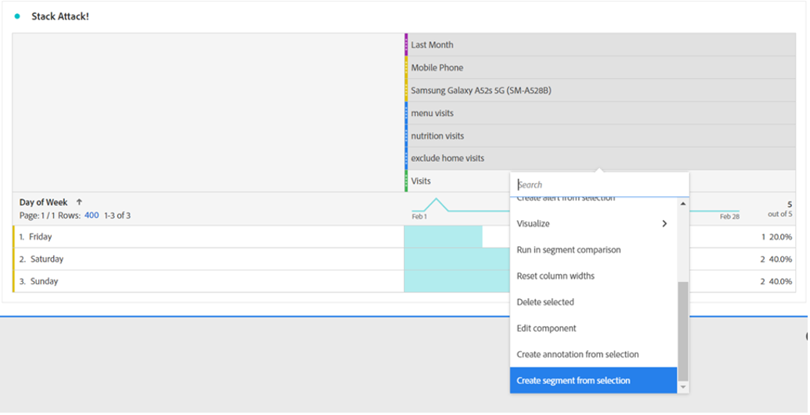
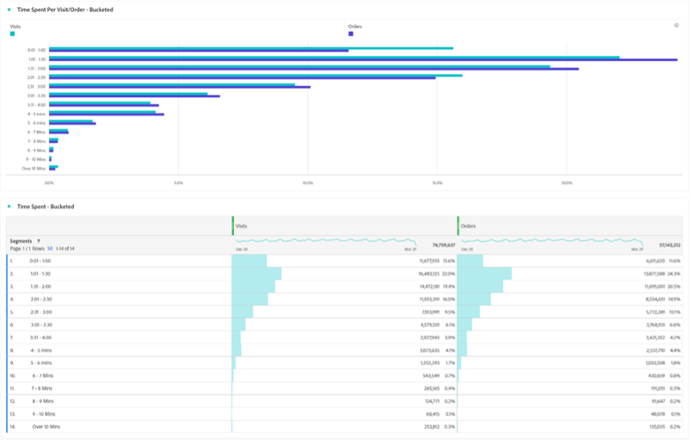

# Ora attendi un segmento... Utilizzo dei segmenti per scoprire nuove informazioni in Analysis Workspace

Sia che tu sia un nuovo utente Adobe Analytics o un professionista esperto, sfrutterai i segmenti in modo abbastanza significativo nei tuoi progetti Analysis Workspace. Come [Adobe Experience League](https://experienceleague.adobe.com/docs/analytics/components/segmentation/seg-overview.html?lang=it) In questa sezione viene descritto come &quot;i segmenti ti consentono di identificare sottoinsiemi di visitatori in base a caratteristiche o interazioni con siti web&quot;. Mentre il risultato di base di questa funzione significa isolare gruppi di utenti, visite o hit sul tuo sito, un analista di mentalità brillante come te può diventare creativo con questo strumento e trovare nuovi modi per ottenere informazioni sull&#39;attività del tuo sito. L&#39;elenco delle opzioni possibili è ampio, quindi non esitate a provare a creare il vostro e condividerlo con altri nella vostra organizzazione o online in comunità come il [Community Adobe Analytics](https://experienceleaguecommunities.adobe.com/t5/adobe-analytics/ct-p/adobe-analytics-community) all&#39;Experience League o [#Measure Slack](https://www.measure.chat/) comunità.

Se hai bisogno di un aggiornamento rapido su come creare un segmento, consulta la documentazione di Experience League sull’utilizzo di [Generatore di segmenti](https://experienceleague.adobe.com/docs/analytics/components/segmentation/segmentation-workflow/seg-build.html?lang=en) in Analysis Workspace.

## Confronto e contrasto dei segmenti

In Analysis Workspace puoi confrontare due segmenti utilizzando &quot;[Confronto tra segmenti](https://experienceleague.adobe.com/docs/analytics/analyze/analysis-workspace/panels/segment-comparison/segment-comparison.html?lang=it)&quot;. Il confronto dei segmenti si trova nella sezione Pannelli della barra di navigazione a sinistra:

Tuttavia, a volte non è necessario un pannello completo di confronto per fornire agli utenti finali informazioni chiave per la loro home page. Per fortuna alcune funzioni possono essere confrontate anche in un pannello standard.

La [Visualizzazione diagramma di Venn](https://experienceleague.adobe.com/docs/analytics/analyze/analysis-workspace/visualizations/venn.html?lang=it) può contribuire a creare un confronto rapido, che ti consente di passare il mouse e vedere le sessioni, gli ordini, gli utenti e così via sovrapposti. tra 2 e 3 segmenti personalizzati. Puoi anche creare rapidamente i segmenti facendo clic con il pulsante destro del mouse su una delle sezioni sovrapposte:

A volte le informazioni importanti non si trovano nei dati sovrapposti, ma nei dati che non si sovrappongono. Un modo rapido per visualizzarlo è creare una copia di un segmento e renderlo un segmento &quot;Escludi&quot;:

impilando il segmento &quot;Escludi&quot; con l’altro segmento nel confronto, ora puoi calcolare rapidamente quante visite hanno colpito la tua pagina del menu senza visualizzare anche la home page nella stessa sessione:

## Attacco Stack

Allo stesso modo, è possibile creare i dati intersecanti di un diagramma di Venn semplicemente impilando tutti i segmenti. Non vi è alcun limite al numero di segmenti o singole dimensioni sovrapposte. Per esempio, se volevo scoprire rapidamente che Giorni della Settimana il mese scorso il mio sito ha avuto una visita su un cellulare, in particolare un Samsung Galaxy A52s, che ha visto il mio menu e le pagine nutrizionali, ma NON ha visto la mia home page, posso costruirlo rapidamente al volo come questo:

Ma ancora meglio, una volta trovato quel sottoinsieme perfetto del mio utente o della mia base di visite, posso selezionare tutti quei valori, fare clic con il pulsante destro del mouse e creare un segmento istantaneamente:

C&#39;è molta energia in un segmento.

## Un segmento di numeri per un numero di segmenti

Molti utenti spesso visualizzano i valori nominali, ordinali o di intervallo durante la creazione di segmenti, ad esempio una pagina visitata, un intervallo di età degli utenti o il numero di visite che un utente ha effettuato in passato. Tuttavia, puoi utilizzare anche i dati del rapporto durante la creazione di un segmento aggregando questi valori, che si tratti di dimensioni standard, metriche standard o variabili e metriche personalizzate per la tua organizzazione.

Ad esempio, il tempo trascorso sulla pagina o il tempo trascorso per visita dispone di bucket predefiniti disponibili:

Tuttavia, queste potrebbero non sempre essere adatte alle esigenze della tua organizzazione - forse la maggior parte delle visite del sito dura meno di 10 minuti. Puoi usare la misurazione granulare per creare bucket di dimensioni diverse. Eccone uno creato per osservare le visite che durano tra 1 minuto, 1 secondo e 1 minuto, 30 secondi:

Una volta creato, ora posso iniziare a guardare le mie visite, ordini e altri eventi da parte dei diversi gruppi di tempo fissi che ho personalizzato:

Puoi anche iniziare a esaminare come i tuoi indicatori prestazioni chiave (KPI, Key Performance Indicators) cambiano in funzione del tempo trascorso da un utente, del numero di pagine visitate durante una visita, del numero di visite che ha visitato in passato o di qualsiasi altro valore numerico, in modo da poter considerare una metrica come un fattore di un’altra metrica:

Le possibilità di utilizzare i segmenti per trovare nuove informazioni sono infinite. Si tratta semplicemente di un punto di partenza. Provane alcuni da solo e fai sapere alla comunità cosa scopri: [Community Adobe Analytics](https://experienceleaguecommunities.adobe.com/t5/adobe-analytics/ct-p/adobe-analytics-community) all&#39;Experience League o [#Measure Slack](https://www.measure.chat/) comunità.

Felice segmentazione!

## Autore

Questo documento è stato scritto da:

**Dan Cummings**, Sr. Product Engineering Analytics Manager presso McDonald&#39;s Corporation

Adobe Analytics Champion

