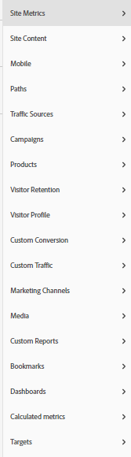

# Guida completa alla transizione ad Adobe Analytics da Google Analytics

## 1. Introduzione

Una delle maggiori sfide nella transizione tra strumenti diversi è imparare a trovare funzionalità equivalenti e imparare a usarle in modo efficiente. Questa discussione fa parte di una guida più ampia per aiutare gli utenti a passare più facilmente ad Adobe Analytics (sia come nuovo utente che come utente proveniente da Google Analytics). un confronto approfondito con GA; come strumento comparativo più probabile con cui la maggior parte degli utenti acquisirà familiarità; viene fornito per aiutare gli utenti a correlare le conoscenze esistenti al nuovo set di strumenti. Non esiste un sostituto della pratica; questo ti aiuterà a iniziare e, si spera, ridurre le frustrazioni che si possono incontrare durante questo periodo (o anche come un rinfrescante dopo aver iniziato ad entrare nell&#39;oscillazione delle cose).

Dovremmo anche fare un rapido confronto terminologico:

| **Descrizione** | **Adobe Analytics** | **Google Analytics** |
|--------------------------------------------------------------------------------------------------------------------------------|---------------------|----------------------|
| È stata visualizzata una metrica evento che rappresenta una pagina (o una schermata di un’app) | Visualizzazioni di pagina | Pageview |
| Una metrica che rappresenta un gruppo di interazioni nel sito web o nell’app che si verificano nello stesso intervallo di tempo | Visita | Sessione |
| Una metrica che definisce un dispositivo identificato (in base a più criteri, inclusi cookie e altri pattern di comportamento per unire le informazioni utente) | Visitatore univoco | Utente |

## 2. Interfacce

Una delle cose che vedo più spesso quando le persone confrontano Adobe Analytics e Google Analytics è che l&#39;Adobe ha molto in corso - è scoraggiante per le persone. Questo è vero, ma è anche; credeteci o no; una forza, non una debolezza. L’Adobe offre un’ampia gamma di strumenti e flessibilità nella visualizzazione dei dati, consentendoti di creare in modo molto più libero ciò di cui hai bisogno.

Cominciamo guardando il reporting &quot;in-site&quot;.

### 2.1. Reporting in-site

#### 2.1.1. Schermata iniziale

Sia Adobe Analytics che Google Analytics consentono di personalizzare la prima visualizzazione visualizzata dall’utente al momento dell’accesso.

##### 2.1.1.1. Schermata iniziale Area di lavoro/Set personalizzato (Adobe Analytics)

Adobe Analytics non presume di creare un rapporto predefinito che tutti gli utenti vedano all’accesso. La home page predefinita porta l’utente alla schermata di destinazione Area di lavoro, che mostrerà a ogni utente tutti i rapporti dell’area di lavoro che ha creato o condiviso con loro. Inoltre, ogni utente ha la possibilità di impostare uno qualsiasi di questi rapporti come schermata iniziale, se lo desidera.

Di seguito saranno riportati ulteriori dettagli su Workspace in seguito in questa guida. Cfr. sezione 2.1.2.1

>[!TIP]
>
>Crea/condividi alcuni rapporti standard per la tua organizzazione in modo che abbiano un punto di partenza per visualizzare le informazioni senza doversi immergere nella creazione dei rapporti.

##### 2.1.1.2. Informazioni sullo schermo interno (Google Analytics)

* Google Analytics Home Screen offre alcune visualizzazioni predefinite per te.  Questi includono cose come:
* Utenti, sessioni, frequenza di rimbalzo e durata della sessione negli ultimi 7 giorni
* Utenti per ora del giorno negli ultimi 30 giorni
* Utenti attuali e pagine attive principali
* Canale di traffico, Origine/Media e Riferimenti negli ultimi 7 giorni
* Sessioni per paese negli ultimi 7 giorni
* Pagine principali per gli ultimi 7 giorni
* Tendenza utenti attivi per gli ultimi 30 giorni
* e altro

In GA4 gli utenti hanno più opzioni per personalizzare e aggiungere i propri report alla Home Screen.

Questa è probabilmente l&#39;unica cosa che vi mancherà di più quando verrete all&#39;Adobe; non dispongono di una schermata iniziale predefinita per te, ma puoi facilmente impostare un’area di lavoro personalizzata per replicare ciò di cui hai bisogno da quanto sopra e, se lo desideri, impostarla come schermata di destinazione. Ulteriori informazioni su questo argomento in seguito (o consulta la sezione 2.1.2.1 Adobe Workspace).

#### 2.1.2. Report Builder nel sito

Oltre ai Rapporti semplici forniti dagli strumenti di analisi, ogni strumento fornisce anche strumenti più potenti con cui creare rapporti personalizzati.

##### 2.1.2.1. Adobe Analytics Workspace

Questa è la potenza di Adobe Analytics, dalla sua introduzione nel 2017 è diventata la piattaforma ideale per l’analisi di Analytics e la ragione principale per cui la sezione Report verrà presto ritirata.

Questo strumento ti consente di creare rapporti con libertà quasi completa.

Il rapporto può essere suddiviso in Pannelli e tali pannelli possono contenere qualsiasi numero di visualizzazioni. I pannelli possono essere impostati su informazioni comuni, ad esempio l’intervallo di date e i filtri comuni dei segmenti.

I pannelli e le visualizzazioni al loro interno possono essere ridimensionati e trascinati per mostrare gli elementi uno accanto all’altro o sovrapposti. Per confrontare due diverse suite di dati una accanto all’altra, potete creare pannelli che si dividono 50/50 in basso al centro, mostrando i due siti uno accanto all’altro per un semplice confronto.

Sono disponibili numerose visualizzazioni per gli utenti:

* Tabella a forma libera
* Tabella coorte
* Abbandono
* Flusso
* Grafici
   * Area (sovrapposta e non sovrapposta)
   * Linee
   * Dispersione
   * Barre (sovrapposte e non sovrapposte)
   * Punto elenco
   * Anello
   * Istogramma
   * Barre orizzontali (sovrapposte e non sovrapposte)
* Mappa
* Blocchi di riepilogo
   * Variazione di riepilogo
   * Testo di riepilogo
   * Testo (campo di testo libero per inserire ulteriori informazioni da fornire al contesto)
* Venn

Ogni pannello e visualizzazione può essere denominato e a cui è applicata una descrizione per fornire contesto alle informazioni visualizzate.
Ad Adobe, i segmenti (essenzialmente filtri per i dati) vengono applicati retroattivamente e possono essere inseriti nelle colonne delle tabelle a forma libera per confrontare i dati uno accanto all’altro. Ad esempio, se un utente desidera confrontare per il traffico due diverse categorie sul sito; possono creare un segmento per &quot;Categoria A&quot; e un segmento diverso per &quot;Categoria B&quot;.

Le tabelle a forma libera consentono più colonne e segmentazione in base alle esigenze per visualizzare i dati nel modo desiderato.

Da quanto sopra, non vuoi vedere un raggruppamento per data? Trascina e rilascia un’altra dimensione o segmento per visualizzare i dati in modo diverso.. come ad esempio l’utilizzo di segmenti per Tipo di dispositivo, quindi aggiungi un raggruppamento per sistema operativo per gli utenti Mobile/Tablet:

Workspace consente alla tua creatività di volare, non sei limitato alle suddivisioni &quot;standard&quot;. Puoi creare le visualizzazioni necessarie per approfondire i confronti da eseguire.

>[!TIP]
>
>Non abbiate paura di giocare ed esplorare, ci sono così tanti modi per pensare fuori dagli schemi qui, vedere cosa potete fare! Ma anche, assicurati di provare a verificare che quello che hai costruito mostra davvero ciò che pensi che sia. L&#39;esperienza qui aiuterà!

Puoi anche creare al volo metriche calcolate o segmenti che vivono solo all’interno del rapporto (evitando l’inondazione dell’archivio dei segmenti e dei calcoli), ma anche assicurarti di creare elementi mirati necessari per rapporti specifici senza confondere l’organizzazione con elementi che non sono molto utilizzabili in altri contesti.

Questa discussione è solo un&#39;introduzione a questo strumento, ci saranno altre guide più complete per iniziare, ma quando lo fai, potrai fare report completi come:

È inoltre necessario notare che le aree di lavoro non vengono salvate automaticamente, pertanto è più semplice creare un rapporto una tantum senza bloccare l’archivio dei rapporti.

Un’altra potente funzione delle aree di lavoro è la possibilità di applicare modificatori interattivi ai rapporti sotto forma di menu a discesa. Anche se questi menu a discesa non funzionano sui file CSV o PDF esportati dei rapporti, all’interno del rapporto live ti consentono di aggiornare tutte le visualizzazioni in un pannello per mostrare lo stesso rapporto in condizioni diverse. È possibile utilizzare più menu a discesa e purché le opzioni non si escludano a vicenda, gli elementi selezionati verranno sovrapposti per consentire un modo pulito di presentare le informazioni.

>[!IMPORTANT]
>
>Per ulteriori informazioni sull’utilizzo dei menu a discesa e delle suddivisioni a forma libera, consulta <https://experienceleaguecommunities.adobe.com/t5/adobe-analytics-discussions/the-power-of-dropdown-filters-and-dimension-breakdowns-in-adobe/td-p/434680>

##### 2.1.2.2. Google Analytics: Dashboard, report personalizzati e report salvati

Google dispone di alcuni strumenti per la creazione di rapporti all’interno dell’interfaccia, ma continua a seguire le stesse visualizzazioni e limitazioni della sezione rapporti .

Ora, per i versi delle Google Analytics mentre leggete questo, potreste dire, &quot;aspetta un secondo, e Google Data Studio, non è un equivalente migliore di quello di Adobe Workspace?&quot; e sarebbe corretto, ma poiché Data Studio non è tecnicamente parte dello strumento Analytics e consente connessioni a diverse origini dati, questo strumento è trattato più avanti nella sezione &quot;Accesso esteso ai rapporti&quot; di questa discussione (in particolare la sezione 2.2.3)

I dashboard e i report personalizzati di Google consentono di richiamare più visualizzazioni in un unico rapporto, ma a differenza di Workspace, sei ancora bloccato in correlazioni semplici e quali dati possono essere inseriti in quali colonne.

Nei report personalizzati, una delle principali sfide è il fatto che quando crei un filtro si applica a tutte le schede del report.. non c&#39;è modo di confrontare due filtri diversi all&#39;interno dello stesso report.

Per confronti di superficie fa il lavoro. Sono tutti simili alle dashboard legacy di Adobe, ai report personalizzati e ai segnalibri. Strumenti di base forniti per supportare le tue esigenze, che risiedono nella suite di rapporti.

#### 2.1.3. Rapporti

Sia Google che Adobe dispongono di alcuni rapporti navigabili, suddivisi per tabelle e grafici della timeline di base basati su una dimensione.

##### 2.1.3.1. Rapporti di Adobe Analytics

Adobe Analytics dispone anche di una sezione Report, anche se in larga misura questo viene gradualmente eliminato a favore del loro Analysis Workspace (e in realtà, la fine del ciclo di vita è stato annunciato per questa interfaccia, dal momento che Workspace [Sezione 2.1.2.1] è uno strumento molto più potente), dove la maggior parte di queste tabelle può essere creata e modificata con maggiore facilità. Le sezioni di Adobe sono molto più suddivise, e questo può essere scoraggiante:

Poiché la maggior parte di quanto sopra è accessibile tramite Workspace, darò una breve panoramica di queste sezioni e del loro rapporto con le Google Analytics, evidenziando qui i rapporti che sono ancora rilevanti.

Metriche del sito è ciò che ti aspetti, copre le metriche standard (visualizzazioni di pagina, visitatori unici, visite ed eventi personalizzati che hai configurato). È simile al report Comportamento GA, ma include anche alcuni elementi che si potrebbero trovare in Audience (poiché Adobe non suddivide i tipi di metrica).

Qui troverai anche rapporti &quot;Bot&quot;, il traffico dai bot è escluso da tutti i tuoi rapporti standard, tuttavia, ci sono due rapporti che ti permettono di vedere alcuni approfondimenti su ciò che sta accadendo e quali bot stanno arrivando al tuo sito. Questo è particolarmente utile se imposti regole bot personalizzate per escludere i bot di spammer noti che colpiscono frequentemente il tuo sito. Si può avere qualche informazione su quello che quei robot stanno facendo senza che le vostre relazioni principali vengano allagate ma quel traffico. I rapporti sui bot non sono attualmente disponibili in Workspace (ma le nuove funzionalità di reporting disponibili a breve consentiranno agli utenti di ottenere queste informazioni anche lì).

Il contenuto del sito è un raggruppamento di dimensioni standard di Adobe: Nome pagina, Sezioni sito (Canali), Gerarchie (un modo per creare rapporti di espansione personalizzati dell’organizzazione all’interno del sito web), Server (questo è particolarmente utile se sul sito sono presenti più sottodomini o se si applicano tag a più siti insieme in una singola suite di tracciamento), ecc. Tutte queste funzioni sono disponibili in Workspace.

Mobile è un raggruppamento di dati specifici per il dispositivo Mobile, come dispositivi, tipi di dispositivi, ecc. Tutte queste funzioni sono disponibili in Workspace.

I percorsi sono un altro degli elementi &quot;non del tutto disponibili in Workspace&quot;... mentre Workspace dispone di un diagramma di flusso, è possibile visualizzare solo i flussi in entrata e in uscita per una singola pagina/valore... mentre i percorsi consentono di visualizzare i percorsi più comuni utilizzati nel sito web. Per impostazione predefinita, Pagine è il primo rapporto sul percorso configurato per l’utente, ma puoi attivarlo per le proprietà personalizzate (ad esempio, se desideri tenere traccia del valore &quot;Page Type&quot;), puoi esaminare i percorsi all’interno dei tipi di pagina. L&#39;altra cosa che mi piace personalmente dei Percorsi è il modo semplice in cui vengono presentate le informazioni... Il diagramma di flusso nell&#39;area di lavoro (a seconda di quanto stai cercando di guardare) può diventare schiacciante. Consiglio di provare entrambi... ognuno ha un uso e un valore a seconda di quello che si sta cercando di ottenere. È opportuno notare che qualsiasi dimensione può essere utilizzata nei flussi, mentre il percorso deve essere impostato su una proprietà nel pannello Amministratore.

I rapporti Origini del traffico, Campagne e Canali di marketing sono tutti simili al rapporto Acquisizione in Google. Origini del traffico si concentra sui referenti effettivi, le campagne si focalizza sui codici campagna e i canali di marketing si concentrano anche sui codici campagna, ma applica anche una logica aggiuntiva, come determinato dall’utente, su come elaborare le informazioni. Trovo che l&#39;Adobe fornisca molta più libertà su come impostare le tue regole, Google fa un sacco di cose per te, e quindi sarà un po&#39; un cambiamento nel modo di pensare. Inoltre, per impostazione predefinita, l’attribuzione di Google sui codici campagna è di 6 mesi, l’Adobe è impostato su 1 settimana. Questo può essere modificato nelle impostazioni dell’amministratore, ma in Workspace puoi applicare l’attribuzione personalizzata a partire da qualsiasi dimensione per offrire una flessibilità molto più rapida.

I rapporti Mantenimento visitatori e Profilo visitatore sono simili ai rapporti Pubblico nelle Google Analytics. Il mantenimento è più incentrato sulla frequenza di ritorno, mentre il profilo del visitatore si concentra maggiormente sulla geografia e sulla tecnologia degli utenti.

Conversione personalizzata e Traffico personalizzato sono entrambi rapporti dimensione personalizzati, Conversioni sono le tue eVar (in cui puoi impostare una scadenza personalizzata per il valore , ad esempio hit, visita, mese, anno e così via. e questo valore rimarrà per l’utente per il tempo specificato, a meno che non venga sovrascritto). Le variabili di traffico sono proprietà dell’utente, ma è anche possibile impostarle per i rapporti sui percorsi o come voci di elenco (che suddivideranno più valori in base a un delimitatore scelto).

I supporti sono per cose come Video o File audio in cui hai impostato un speciale tracciamento dei contenuti multimediali.

Rapporti personalizzati è una sezione in cui un utente può personalizzare le colonne e le suddivisioni create all’interno dell’interfaccia dei rapporti e salvarle come rapporto personalizzato. Tuttavia, come accennato in precedenza, poiché Workspace consente suddivisioni e correlazioni molto più potenti, qualsiasi cosa personalizzata dovrebbe essere fatta lì. Questa era una buona soluzione prima dell’esistenza di Workspace.

La sezione Segnalibri è simile ai Rapporti personalizzati, dove i rapporti utilizzati di frequente possono essere contrassegnati con segnalibri all’interno dell’interfaccia dei rapporti, per facilitarne l’individuazione.

Dashboard era un prodotto legacy che consentiva alle persone di combinare minirapporti di dati in un’unica visualizzazione. Tuttavia, la funzionalità di Workspace (Sezione 2.1.2.1) è molto più semplice da utilizzare, in quanto esiste solo come punto di accesso ai rapporti legacy che devono essere ricostruiti prima che questa funzione venga disattivata.

Target è un’area di rapporto speciale che consente alle persone di creare un rapporto basato su un target entro un determinato intervallo di tempo, in modo che i team possano monitorare elementi come le campagne e vedere se sono sulla buona strada per raggiungere i propri target di traffico.

Tutti i rapporti qui consentiti per più colonne di metrica e raggruppamenti di dimensioni. ma la semplicità delle visualizzazioni e una parte della logica che sta dietro ciò che gli elementi potrebbero essere correlati potrebbe a volte essere frustrante.

##### 2.1.3.2. Rapporti sulle Google Analytics

Google Analytics suddivide questi rapporti nelle sezioni seguenti: In tempo reale, pubblico, acquisizione, comportamento e conversazioni (in GA3) e nel ciclo di vita (con le sottosezioni: Acquisizione, coinvolgimento, monetizzazione, mantenimento) e utente (con le sottosezioni: Demografia e tecnologia).

Puoi apportare alcune modifiche minori a queste visualizzazioni, aggiungere una suddivisione secondaria delle dimensioni, modificare la visualizzazione, creare un filtro per i dati, ecc. Puoi salvare le personalizzazioni come rapporto salvato.

che ti permettono di ottenere informazioni semplici e veloci sui tuoi dati. Tuttavia, non è possibile confrontare elementi come Utenti con visualizzazioni di pagina per una pagina nella stessa tabella e non è possibile aggiungere più di una dimensione aggiuntiva per visualizzare dati aggiuntivi.

Questi sono buoni per i dati analitici rapidi, ma se hai davvero bisogno di scavare in profondità, soffrono dei limiti.

### 2.2. Accesso esteso ai rapporti

Oltre a &quot;Reporting in-site&quot;, la maggior parte degli strumenti offre funzionalità estese che ti consentono di portare l&#39;analisi al di fuori degli strumenti e creare qualcosa di un po&#39; più personalizzato.

#### 2.2.1. Report Builder Adobe Analytics (estensione Microsoft Excel)

Workspace è un ottimo strumento, ma a volte è necessario inserire i dati in un foglio di calcolo personalizzato, in modo da poter unire più sorgenti di dati. Ecco dove entra in gioco il Report Builder.

Report Builder è un plug-in per Microsoft Excel che ti consente di creare connessioni ai dati Adobe Analytics per estrarre dati tabulari che puoi manipolare all’interno di Excel. In genere, per utilizzarlo in modo efficiente, puoi inserire i dati in alcune schede di dati non elaborati, quindi utilizzare i riferimenti alle celle in excel per estrarre i dati da queste schede in un unico rapporto consolidato, quindi creare grafici e visualizzazioni.

>[!NOTE]
>
>Il Report Builder dispone di un&#39;autorizzazione speciale che deve essere applicata agli utenti per accedere a questo plug-in. Questo dovrebbe probabilmente essere concesso solo agli utenti che hanno imparato a utilizzare correttamente lo strumento.

#### 2.2.2. Connessione API Adobe Analytics

Se hai bisogno che il tuo Adobe Analytics venga digerito da qualcosa di diverso da excel, ma desideri comunque i vantaggi dei dati elaborati (comprese le esclusioni di regole di bot), puoi utilizzare l’API di Adobe per estrarre i dati direttamente, quindi elaborarli tramite script o aggiungerli a un database da utilizzare con un altro sistema.

È opportuno notare che l’API estrae ancora i dati di correlazione applicando le suddivisioni e i segmenti come specificato nella richiesta di pull.

Area di lavoro di Adobe (sezione 2.1.2.1) utilizza effettivamente l’API per generare tutti i rapporti. Se abiliti la modalità di debug in Workspace, verranno mostrate le chiamate API utilizzate. Questo è un modo rapido per generare le chiamate API utilizzando Workspace per generare e convalidare i dati da richiamare, quindi utilizza le chiamate API per estrarre i dati dalla tua elaborazione.

#### 2.2.3. Google Analytics Data Studio

Se stai leggendo, saprai già dall&#39;alto che ho citato Data Studio come equivalente all&#39;area di lavoro di Adobe. Data Studio consente di estrarre dati di Google Analytics, ma anche dati da altre sorgenti. Questa funzione è utile per consolidare i dati analitici con altri dati raccolti; ma quando si tratta di Google Analytics, ho trovato lo stesso tipo di limitazioni di visualizzazione presenti nelle Google Analytics. Il modo in cui vengono formate le righe e le colonne è ancora molto limitato in ciò che è possibile fare.

È ancora uno strumento potente, e non dissuaderei la gente dall&#39;usarlo in alcun modo, ma la mia esperienza personale è che avendo usato Workspace per così tanto tempo, trovo che il comportamento rigido sia piuttosto limitante.

#### 2.2.4. Estensione del foglio di calcolo Google

Per i miei usi, quando ho bisogno di estrarre i dati in modo esteso dalle Google Analytics, il mio strumento personale di scelta è l&#39;estensione foglio di calcolo Google. Certo, ho bisogno di fare più connessioni alle mie tabelle GA, ma come il Report Builder di Adobe, posso fare riferimento alle celle dai dati grezzi e costruire i report di cui ho bisogno, poi visualizzarli utilizzando le funzionalità di grafica del foglio di calcolo di Google.

## 3. Esportazioni di dati grezzi

Per quei momenti hai davvero bisogno di dati grezzi, sia Adobe che Google offrono la capacità di estrarre le informazioni in questo modo.

### 3.1. Feed di dati di Adobe

Nella sezione 2.2.2, ho menzionato che l’API Adobe Analytics ha estratto da &quot;dati elaborati&quot;. Il feed di dati non elaborati eseguirà comunque il pull dei dati elaborati dalle &quot;Regole di elaborazione&quot; configurate nel pannello di amministrazione (assicurati che i tuoi dati non elaborati vengano ritardati per garantire che tutte queste regole siano state completate entro il momento in cui il feed di dati non elaborati viene estratto), ma questi dati non elaborati includeranno tutti i dati che sono esclusi ovunque altro.

Questo significa che tutte le esclusioni Bot, i dati filtrati IP interni, ecc. verranno inclusi nei feed di dati non elaborati. Esistono flag per identificare questi dati, in modo che se si sta creando un data lake, il team di progettazione possa creare una logica per elaborare tali dati di conseguenza.

I feed di dati non elaborati possono essere personalizzati per inviare tutte le colonne di dati, oppure solo colonne specifiche se è necessario un feed più mirato.

I feed possono essere inviati direttamente a FTP, SFTP, S3, ecc.

### 3.2. Big Query Google

Sfortunatamente, questo è uno strumento Google che non ho avuto alcuna esperienza utilizzando, ma in teoria dovrebbe essere simile al feed dati di Adobe, consentendo al tuo team di ingegneria di accedere ai dati non elaborati dal tuo account Google Analytics.

Tuttavia, credo che invece di un dump completo di dati grezzi, permette ai tuoi ingegneri di accedere ai dati tramite query SQL, in modo che possano estrarre o dati non elaborati mirati o se desiderano estrarre tutte le colonne di dati grezzi per acquisire in un lago di dati.

## 4. Conclusione

Come qualsiasi sistema, è necessario esercitarsi per essere a proprio agio con esso, ma si spera che questa guida ti permetterà di iniziare, o ti darà suggerimenti per migliorare il tuo utilizzo di Adobe Analytics se hai solo graffiato la superficie.

Sottolineerò tuttavia che consiglierei di utilizzare sia Adobe Analytics che Google Analytics nella strategia di implementazione (anche se le Google Analytics sono solo la versione gratuita). Questo consente di disporre di un sistema di backup per garantire la disponibilità di dati, in quanto nessun sistema è infallibile.

Oltre a questa guida sono disponibili numerose risorse che possono contribuire a migliorare la tua strategia:

* [Adobe Experience League](https://experienceleague.adobe.com/?lang=it#home) - Contiene esercitazioni, video, documentazione e forum della community
* [Adobe di gruppi di utenti](https://analytics-augs.adobe.com/) - Un hub di eventi gestiti dalla community per consentire agli utenti di connettersi tra loro e migliorare le loro implementazioni - poiché si basano su un fuso orario specifico, è meglio controllare anche le altre aree geografiche in esecuzione.
* [Canale YouTube dei gruppi di utenti Adobe Analytics](https://www.youtube.com/channel/UCQOHnCs7KZgsuFHVzwboQuA) - Impossibile creare una sessione del gruppo utenti di Adobe Analytics? Per ulteriori informazioni sull’utilizzo dello strumento da parte dei colleghi, consulta le sessioni precedenti del gruppo di utenti in tutto il mondo.
* [Misura canale di Slack chat](https://www.measure.chat/) - Connettiti con gli utenti Adobe Analytics di tutto il mondo e condividi le lezioni del settore, fai domande ai tuoi colleghi e unisciti a gruppi di interesse incentrati sulla misurazione.
* e di più!

## Autore

Questo documento è stato scritto da:

Jennifer Dungan, Optimization Manager Analytics a Torstar

Campione Adobe Analytics

