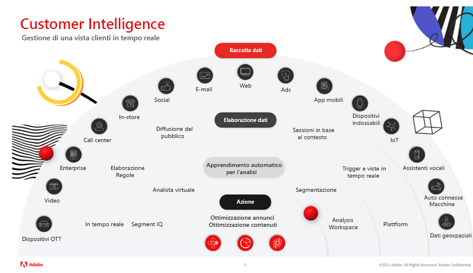

# Padroneggiare le informazioni sui clienti con Virtual Analyst e Segment IQ in Adobe Analytics

In questo articolo scopri l’importanza di utilizzare l’intelligenza artificiale e l’apprendimento automatico (IA/ML). Quindi, leggi i vantaggi e le storie di successo reali di clienti globali che utilizzano Virtual Analyst and Segment IQ per rilevare anomalie, evitare scostamenti e massimizzare il ROI.

## Il valore dell’intelligenza artificiale

Forse ricordi quando il campione di scacchi Garry Kasparov fu sconfitto dal [!DNL Deep Blue] di IBM®. Gli esperti erano convinti che una macchina non potesse battere il processo decisionale e il giudizio umano in un gioco complesso come gli scacchi. Invece è successo, e questo è stato fondamentale per un cambiamento radicale nella strategia aziendale e nell’innovazione tecnologica, in quanto la potenza dell’intelligenza artificiale è stata portata alla luce.

Adobe Analytics è il sistema di intelligence principale nel business delle esperienze, che consente a chiunque nell’azienda di comprendere e ottimizzare le interazioni dei clienti con il proprio marchio in tutti i punti di contatto in tempo reale e su vasta scala.

Gli strumenti di intelligenza artificiale di Adobe non intendono sostituirti, ma piuttosto consentirti di ottenere il massimo ROI dal tuo lavoro.

## Trasformare le analisi

Per evolvere l’analisi, dobbiamo concentrarci su tre considerazioni chiave:

1. Organizzazione: come creare visualizzazioni olistiche dei clienti, definire le priorità delle decisioni basate su informazioni e democratizzare i dati.

1. Tecnologia: come assicurarsi che dati e tecnologie forniscano personalizzazioni su larga scala.

1. Cliente: come generare fiducia e adattarsi al cambiamento.

Le attività di analisi sono impegnative e richiedono tempo, tuttavia è necessario accelerare il time-to-insight. I problemi principali affrontati dalle organizzazioni includono:

* Risorse organizzative limitate: numerosi obiettivi aziendali possono limitare la disponibilità di risorse.
* Competenze tecniche limitate: è possibile condividere le conoscenze e democratizzare i dati?
* Aspettative dei clienti: il team può reagire dinamicamente ai cambiamenti di comportamento dei clienti?

## Padroneggiare le informazioni sui clienti con Virtual Assistant, con tecnologia Adobe Sensei

### Tre livelli di informazioni sul cliente

Quando si tratta di una strategia di successo per le informazioni sul cliente, prima di poter agire e ottimizzare i contenuti e annunci dobbiamo passare attraverso tre livelli (vedi figura 1 sopra): (a) raccolta dati, (b) elaborazione dati e (c) analisi e apprendimento automatico.

1. La raccolta dati dipende dall’organizzazione e può includere vari canali e media. I dati possono provenire ad esempio da dispositivi OTT, video, sistemi aziendali, call center, in-store, e-mail, social, web, annunci, app mobili, dispositivi indossabili, IoT, assistenti vocali, schede connesse e dati geospaziali.

1. L’elaborazione dei dati include la raccolta dati in tempo reale, regole di elaborazione, diffusione del pubblico, creazione di sessioni in base al contesto, attivatori e visualizzazioni in tempo reale, e piattaforma.

1. Analytics e l’apprendimento automatico includono Segment IQ, Virtual Analyst, Segmentation, Analysis Workspace

### Sfruttare un Virtual Analyst personale

Pensa al [Virtual Analyst](https://experienceleague.adobe.com/docs/analytics/analyze/analysis-workspace/virtual-analyst/overview.html?lang=it) come al super analista che:

* Non lascia mai l’ufficio e non ha bisogno di farlo.
* È in grado di dirti tutto (chi, cosa, quando, dove e perché) del tuo business.
* Reagisce all’istante ad avvisi intelligenti provenienti dal monitoraggio delle anomalie 24/7 su tutti i dati.
* È in grado di riprogettare componenti per [!UICONTROL Analysis Workspace].

### Scoprire opportunità nascoste

* Ottieni visibilità sempre aggiornata sullo stato dei KPI di marketing.
* Effettua buoni investimenti di marketing in modo affidabile e prevedibile.
* Soddisfa e supera le aspettative dei clienti.

### Successo nel mondo reale

L’analista virtuale ha scoperto i seguenti scenari per clienti di Adobe:

* Terminazione di una campagna: aumento giornaliero di 1,7 milioni di dollari di ricavi dovuto principalmente a una campagna terminata prematuramente.
* Bug del fornitore: aumento del 73% nelle rimozioni dal carrello a causa di un bug del gestore dei tag che provocava la rimozione automatica di alcuni prodotti dal carrello.
* Problema del browser: aumento dell’8% dell’abbandono del carrello associato ai browser Chrome. Questa correzione ha portato a un incremento giornaliero di 1,2 milioni di dollari nei ricavi.
* Frode di coupon: rilevato un picco dell’81% negli ordini riconducibile al traffico proveniente da due importanti siti di offerte o coupon giornalieri, che promuovevano coupon fraudolenti per articoli di iigiene personale. Questi ordini sono stati annullati.
* Spionaggio aziendale: aumento del 200% delle visite causate da bot o crawler creati dal principale concorrente per prendere contenuti dal sito allo scopo di riutilizzarli. Questi IP sono stati bloccati.

## Funzionalità di Adobe Analytics

[Rilevamento delle anomalie](https://experienceleague.adobe.com/docs/analytics/analyze/analysis-workspace/virtual-analyst/anomaly-detection/anomaly-detection.html?lang=it):

* Utilizza algoritmi predittivi incorporati per individuare picchi e ribassi nei dati che non conoscevi.
* Utilizza 28 algoritmi univoci per individuare le anomalie, tra cui stagionalità, crescita e modelli ciclici, nonché allineamento alle festività.
* Riduci la dipendenza da Data Scientist e sfrutta le capacità di Citizen Data Scientist.

[Analisi contributi](https://experienceleague.adobe.com/docs/analytics/analyze/analysis-workspace/virtual-analyst/contribution-analysis/ca-tokens.html?lang=it):

* Identifica rapidamente i fattori che hanno contribuito a cambiamenti significativi nei dati.
* Risparmia innumerevoli ore dedicate alla ricerca di spiegazioni sui cambiamenti nelle metriche.
* Sfrutta le potenti capacità di apprendimento automatico progettate per trasformare analisti e addetti al marketing in Data Scientist.

[Avvisi intelligenti](https://experienceleague.adobe.com/docs/analytics/analyze/analysis-workspace/virtual-analyst/intelligent-alerts/intellligent-alerts.html?lang=it):

Rimani sempre aggiornato sulle anomalie presenti nei tuoi dati, sia in ufficio che in movimento.

* Crea avvisi direttamente da Analysis Workspace.
* Definisci le regole in base a anomalie (90%, 95%, 99%), percentuale di variazione e soglia massima o minima.
* Utilizza [!UICONTROL Alert Preview] per vedere con quale frequenza sarebbe stato attivato un avviso.
* Utilizza il supporto per SMS ed e-mail con collegamenti verso progetti [Analysis Workspace](https://experienceleague.adobe.com/docs/analytics/analyze/analysis-workspace/home.html?lang=it) generati automaticamente.

[Segment IQ](https://experienceleague.adobe.com/docs/analytics/analyze/analysis-workspace/segment-iq.html?lang=it):

* Scopri le differenze e le sovrapposizioni tra i segmenti per prendere decisioni informate in merito alla strategia di segmentazione.
* Scopri le caratteristiche chiave dei segmenti di pubblico che incidono sui tuoi KPI.
* Ottieni in pochi secondi o minuti rapporti e visualizzazioni che evidenziano caratteristiche comuni a dimensioni, metriche e altri segmenti.
* Migliora il coinvolgimento dei clienti di alto valore.

## Successo nel mondo reale con Segment IQ

**Dispositivi mobili e desktop:** “Abbiamo confrontato gli hit tra due dei nostri siti e abbiamo riscontrato rapidamente diverse incongruenze a livello di tag.” → Evitare problemi di dati prima del rilascio di un prodotto

**Utilizzo della funzione:** “Abbiamo scoperto che i clienti che utilizzavano la nostra funzionalità di confronto dei prodotti erano il 10% più propensi all’acquisto. L’abbiamo quindi spostata nella parte superiore della pagina, e abbiamo visto un incremento degli ordini.” → Aumento del 4% nella conversione

**Coinvolgimento con i contenuti:** “Abbiamo scoperto che i visitatori della sezione news avevano una probabilità di due volte superiore di guardare video pubblicitari, così abbiamo aggiunto più opzioni video a quella sezione.” → Aumento del 7% degli annunci video visualizzati

**Ricerca a pagamento:** “I visitatori provenienti da motori di ricerca avevano una probabilità tre volte superiore di acquistare articoli aggiuntivi. Di conseguenza, abbiamo aumentato la spesa per parole chiave specifiche”. → 56% aumento di upselling

**Scorta del prodotto:** “Le persone che desideravano acquistare Fitbit avevano una probabilità sei volte superiore di riscontrare un “esaurito” rispetto agli altri, per questo abbiamo deciso di aumentare gli ordini di Fitbit”. → Meno prodotti esauriti e più ordini completati in periodi di vacanze

Per maggiori informazioni, guarda il nostro [webinar](https://adobecustomersuccess.adobeconnect.com/pmetho6ivh68/).

Per saperne di più su strategia e leadership di pensiero, visita l’hub [Customer Success](https://experienceleague.adobe.com/docs/customer-success/customer-success/overview.html).