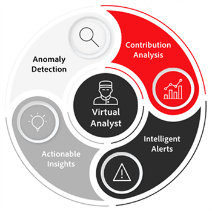

# Masterizzazione delle informazioni sui clienti con Virtual Analyst e Segment IQ in Adobe Analytics

In questo articolo impara l&#39;importanza di utilizzare l&#39;intelligenza artificiale e l&#39;apprendimento automatico (AI/ML). Quindi, esamina i vantaggi e le storie di successo reali dei clienti globali che utilizzano Analista virtuale e IQ segmento per rilevare le anomalie, evitare gli scostamenti e massimizzare il ROI.

## Il valore dell&#39;intelligenza artificiale

Forse ricordate il campione di scacchi del tempo Garry Kasparov è stato sconfitto da IBM® [!DNL Deep Blue]. Gli esperti sono convinti che una macchina non possa battere il processo decisionale e il giudizio umano in un gioco complesso come gli scacchi. Tuttavia, è stato fatto e questo è stato fondamentale per un cambiamento fondamentale nella strategia aziendale e nell&#39;innovazione tecnologica, in quanto la potenza dell&#39;intelligenza artificiale è stata dissotterrata.

Adobe Analytics è il sistema di intelligenza principale per il business delle esperienze, che consente a chiunque nell’azienda di comprendere e ottimizzare le interazioni dei clienti con il proprio marchio in tutti i punti di contatto in tempo reale e su vasta scala.

Gli strumenti di intelligenza artificiale di Adobe non sono qui per sostituirti, ma piuttosto per consentirti di ottenere il massimo ROI sui tuoi sforzi.

## Trasforma le tue analisi

Per evolvere l’analisi, dobbiamo concentrarci su tre considerazioni chiave:

1. Organizzazione : modalità di creazione di visualizzazioni olistiche dei clienti, definizione delle priorità per le decisioni basate su informazioni e democratizzazione dei dati.

1. Tecnologia: come assicurarti che i dati e la tecnologia forniscano personalizzazioni su larga scala.

1. Cliente - Come costruire la fiducia e adattarsi al cambiamento.

Analytics è impegnativo e dispendioso in termini di tempo, eppure c&#39;è una costante necessità di accelerare il time-to-insight. I problemi principali affrontati dalle organizzazioni includono:

* Risorse organizzative limitate - vari obiettivi aziendali possono limitare la disponibilità di risorse
* Competenze tecniche limitate: è possibile condividere le conoscenze e democratizzare i dati
* Aspettative dei clienti: il team può reagire dinamicamente ai cambiamenti di comportamento dei clienti

## Informazioni principali sui clienti con Virtual Assistant, basato su Adobe Sensei

### 3 Livelli di intelligenza dei clienti

Quando si tratta di una strategia di customer intelligence di successo, dobbiamo passare attraverso tre livelli (vedi figura 1 sopra) da: (a) raccolta dati, (b) elaborazione dati, (c) analisi e apprendimento automatico, prima di poter finalmente agire e ottimizzare i nostri contenuti e annunci.

1. La raccolta dei dati dipende dall’organizzazione e può includere vari canali e media. Questi includono dispositivi OTT, video, aziende, call center, in-store, e-mail social, web, annunci, app mobili, wearables, IoT, assistenti vocali, schede connesse, e geo / spaziale.

1. L’elaborazione dei dati include la raccolta dei dati in tempo reale, le regole di elaborazione, la sindacazione del pubblico, la sessionizzazione in base al contesto, gli attivatori e le visualizzazioni in tempo reale e la piattaforma.

1. Analytics e machine learning includono Segment IQ, Virtual Analyst, Segmentation, Analysis Workspace

### Sfruttare il tuo Analista virtuale

Pensate ai [Analista virtuale](https://experienceleague.adobe.com/docs/analytics/analyze/analysis-workspace/virtual-analyst/overview.html?lang=en) come analista rock star che:

* Non lascia mai l&#39;ufficio e non deve
* Racconta chi, cosa, quando, dove, perché e così che cosa del tuo business
* Agisce istantaneamente su avvisi intelligenti provenienti dal monitoraggio delle anomalie 24/7 in tutti i dati
* È in grado di rimuovere componenti per [!UICONTROL Analysis Workspace]

### Scopri opportunità nascoste

* Ottenere visibilità aggiornata allo stato dei KPI di marketing
* Effettuare buoni investimenti di marketing in modo affidabile e prevedibile
* Mantenere e soddisfare / superare le aspettative dei clienti

### Successo nel mondo reale

L&#39;analista virtuale ha scoperto i seguenti scenari per i clienti di Adobi reali:

* Terminazione campagna - Aumento giornaliero di $ 1,7 milioni di ricavi dovuto principalmente a una campagna terminata prematuramente.
* Bug fornitore - Aumento del 73% degli assorbimenti del carrello a causa di un bug di gestione tag che stava rimuovendo automaticamente alcuni prodotti dal carrello.
* Problema del browser - Aumento dell&#39;8% nell&#39;abbandono del carrello associato ai browser Chrome. Questa correzione ha portato a un incremento incrementale giornaliero di 1,2 milioni di dollari nei ricavi.
* Frode di coupon - Identificato un picco dell&#39;81% negli ordini causato dal traffico indicato da due importanti siti giornalieri di offerte / coupon promotori di coupon fraudolenti di toilette. Questi ordini sono stati annullati.
* Corporate Espionage - Aumento del 200% delle visite causate da bot/crawler creati dal loro principale concorrente per scolpire i contenuti dal loro sito per riutilizzarli. Questi IP sono stati in grado di essere bloccati.

## Funzionalità di Adobe Analytics

[Rilevamento delle anomalie](https://experienceleague.adobe.com/docs/analytics/analyze/analysis-workspace/virtual-analyst/anomaly-detection/anomaly-detection.html?lang=en):

* Utilizza algoritmi predittivi incorporati per identificare picchi e ribassi nei dati che non conoscevi.
* Utilizza 28 algoritmi univoci per identificare le anomalie, tra cui stagionalità, crescita e modelli ciclici, nonché l’allineamento delle festività.
* Ridurre la dipendenza dagli scienziati dei dati e sbloccare le capacità degli scienziati dei dati dei cittadini.

[Analisi contributi](https://experienceleague.adobe.com/docs/analytics/analyze/analysis-workspace/virtual-analyst/contribution-analysis/ca-tokens.html?lang=en):

* Identifica rapidamente i fattori che hanno contribuito alla modifica dei tuoi dati in modo significativo.
* Risparmia innumerevoli ore cercando spiegazioni sui cambiamenti nelle metriche.
* Sfrutta l&#39;apprendimento automatico potente progettato per trasformare analista e addetto al marketing in uno scienziato informatico.

[Avvisi intelligenti](https://experienceleague.adobe.com/docs/analytics/analyze/analysis-workspace/virtual-analyst/intelligent-alerts/intellligent-alerts.html?lang=en):

Informati sempre delle anomalie presenti nei tuoi dati, sia in ufficio che in movimento

* Creare avvisi direttamente da Analysis Workspace
* Regole di base relative alle anomalie (90%, 95%, 99%), modifica della percentuale e superiore/inferiore
* Utilizzo [!UICONTROL Alert Preview] per vedere con quale frequenza sarebbe stato attivato un avviso
* Utilizzo del supporto SMS ed e-mail con collegamenti a generato automaticamente [Analysis Workspace](https://experienceleague.adobe.com/docs/analytics/analyze/analysis-workspace/home.html?lang=en) progetti

[Segment IQ](https://experienceleague.adobe.com/docs/analytics/analyze/analysis-workspace/segment-iq.html?lang=en):

* Scopri le differenze e le sovrapposizioni tra i segmenti per informare la strategia di segmentazione
* Scopri le caratteristiche chiave dei segmenti di pubblico che guidano i tuoi KPI
* Ottieni rapporti e visualizzazioni in pochi secondi o minuti che mostrano comuni tra dimensioni, metriche e altri segmenti
* Migliorare il coinvolgimento dei clienti di alto valore

## Successo nel mondo reale con Segment IQ

**Dispositivi mobili e desktop:** &quot;Abbiamo confrontato le hit da uno dei nostri siti a un altro e abbiamo rapidamente riscontrato diverse incongruenze a livello di assegnazione tag.&quot; → Evitare problemi di dati prima del rilascio di un prodotto

**Utilizzo delle funzioni:** &quot;I clienti che hanno utilizzato la funzionalità di confronto del nostro prodotto avevano il 10% di possibilità di decidere per l’acquisto. Spostandolo nella parte superiore della pagina, gli ordini aumentavano.&quot; → aumento del 4% nella conversione

**Interazione con i contenuti:** &quot;Abbiamo scoperto che i visitatori della nostra sezione news avevano una probabilità di due volte superiore di guardare video pubblicitari, per questo abbiamo aggiunto più opzioni video a quella sezione.&quot; → aumento del 7% degli annunci video visualizzati

**Ricerca a pagamento:** &quot;I visitatori provenienti da motori di ricerca avevano una probabilità di upselling 3 volte superiore. Abbiamo aumentato la spesa per parole chiave specifiche come risultato.&quot; → 56% di upselling

**Scorta del prodotto:** &quot;Le persone che acquistavano Fitbit avevano una probabilità 6 volte superiore di ottenere un &quot;esaurito&quot; rispetto agli altri, per questo abbiamo deciso di aumentare gli ordini di Fitbit.&quot; → Scorte evitate e più ordini di vacanza completati

Per maggiori informazioni, guarda la nostra [webinar](https://adobecustomersuccess.adobeconnect.com/pmetho6ivh68/).
